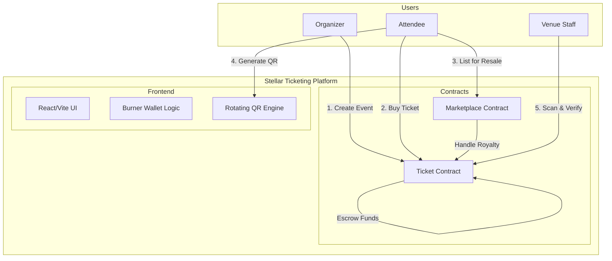
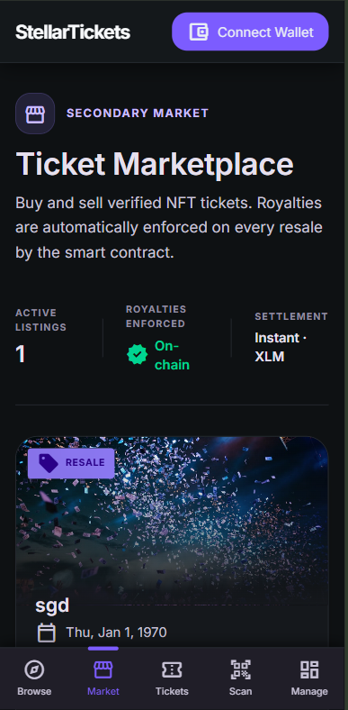
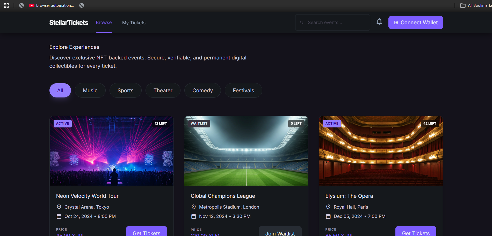
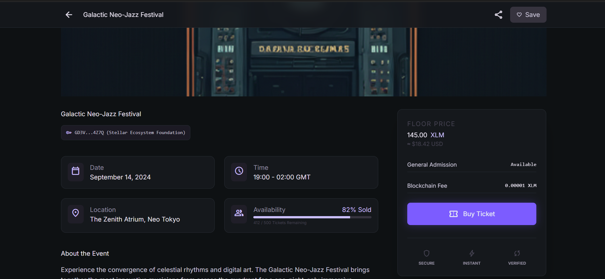
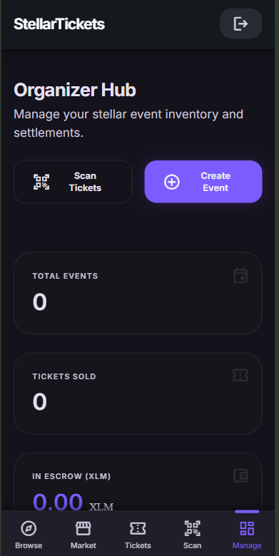

# 🎟️ Stellar Ticketing

NFT event ticketing on Stellar. Built with Soroban.

[](https://github.com/TusharDarsena/stellar/actions)

Stellar Ticketing is a decentralized platform for event management and NFT ticketing. It leverages Soroban smart contracts to handle event creation, ticket minting, escrowed payments, and restricted resales with automatic royalty enforcement. Attendees enjoy a "crypto-less" experience via Burner Wallets and rotating QR codes for secure entry.

---

## Demo Video


## 🚀 Live Demo 

- **Live Demo**: [stellar-gamma-weld.vercel.app](https://stellar-gamma-weld.vercel.app/)

## Contact Addresses
- **Ticket Contract**: [`CC2EV22Q3MRKNYKWAFUODA7IH2UGT7NCDASHU62QY4UAMAI4KTW6NFTQ`](https://stellar.expert/explorer/testnet/contract/CC2EV22Q3MRKNYKWAFUODA7IH2UGT7NCDASHU62QY4UAMAI4KTW6NFTQ)
- **Marketplace Contract**: [`CAFFG3YKYG7BURNQ4SU6SB6MKLDQQIAAWORT3MICHKGCXMDJEQB7KGWT`](https://stellar.expert/explorer/testnet/contract/CAFFG3YKYG7BURNQ4SU6SB6MKLDQQIAAWORT3MICHKGCXMDJEQB7KGWT)

---

## 🏗 Architecture Diagram



---

## 📖 How to Use (Step by Step)

### For Organizers
1.  **Connect**: Link your Freighter wallet to the dashboard.
2.  **Create**: Set up an event with name, date, capacity, and XLM price.
3.  **Manage**: Track sales and revenue in real-time.
4.  **Verify**: Use the built-in scanner to check attendees in at the door.

### For Attendees
1.  **Sign In**: Use Google or email (Burner Wallet generated automatically).
2.  **Browse**: Explore upcoming events on the Stellar network.
3.  **Purchase**: Buy tickets with XLM. Funds are held in escrow until the event.
4.  **Enter**: Show your dynamic, rotating QR code at the venue.

See the full [User Guide](docs/architecture.md) for more technical details.

---

## 📜 Contract Functions Explained

### Ticket Contract
- `create_event`: Initializes a new event with metadata and pricing.
- `purchase`: Mints a ticket NFT to the buyer and holds XLM in escrow.
- `verify_entry`: Validates a signed QR payload against the owner's address.
- `cancel_event`: Triggers automatic refund logic for all ticket holders.

### Marketplace Contract
- `list_ticket`: Creates a resale listing for a ticket NFT.
- `buy_listing`: Executes the transfer, ensuring royalties are paid to the organizer.
- `cancel_listing`: Removes a ticket from the marketplace.

---

## 🔒 Security Checklist

### Smart Contracts
- [x] `address.require_auth()` on all guarded functions
- [x] `checked_*` arithmetic for all I128 operations
- [x] Escrowed funds isolated per event
- [x] Restricted transfer logic for royalties
- [x] Persistent storage for long-term data

### Frontend
- [x] Client-side transaction simulation before submission
- [x] Burner Wallet keys stored securely in `localStorage`
- [x] No hardcoded contract addresses (uses `.env`)
- [x] QR payloads timestamped and signed to prevent replay attacks

---

## 📱 Mobile Screenshot



---

## 🔍 Monitoring & Observability

Monitor contract interactions and event health via Stellar's public infrastructure.

- **Stellar Expert**: View ticket mints and marketplace transfers in real-time.
- **Soroban RPC**: Logs for transaction simulation and submission.
- **Contract Events**: All state changes emit standard Soroban events for indexing.

### Ticket Contract Activity (Stellar Expert)


### Marketplace Contract Activity (Stellar Expert)


---

## 📊 Metrics Dashboard

[Metrics Dashboard Link](https://stellar-gamma-weld.vercel.app/metrics)



---

## 🗂 Data Indexing

We utilize Soroban's event system to discover and display platform data.

- **Event Discovery**: `SorobanRpc.getEvents()` is used to find all `create_event` calls.
- **Ticket Library**: Filters on-chain events to find tickets owned by the current wallet.
- **History**: Transaction logs provide a full audit trail of purchases and transfers.

---

## 🛡️ Technical Deep Dive

### Rotating QR Codes (D-027)
To prevent ticket duplication, our platform uses rotating QR codes. Every 30 seconds, a new payload is generated containing:
1. `ticket_id`
2. `current_timestamp`
3. `signature` (signed by the attendee's Burner Wallet)

The venue scanner verifies the signature and ensures the timestamp is within a ±30s window.

### Burner Wallets (D-028)
Attendees shouldn't need to understand seed phrases. We generate a one-time `Keypair` on the fly, store the secret in the browser, and fund it via Friendbot for a seamless onboarding experience.

---

## ⚙️ Advanced Features

| Feature                | Description                                                     |
| ---------------------- | --------------------------------------------------------------- |
| **Restricted Resale**  | Tickets can only be resold via our verified marketplace.        |
| **Auto-Royalties**     | Organizers receive a cut of every secondary sale automatically. |
| **Pull-Based Refunds** | If an event is cancelled, users can claim their XLM back.       |
| **Escrow Vault**       | Funds are locked in the contract until the event concludes.     |

---

## 💻 Local Setup Instructions

### Prerequisites
- [Stellar CLI](https://developers.stellar.org/docs/build/smart-contracts/getting-started/setup)
- Rust & wasm32 target
- Node.js & npm

### Steps
1.  **Clone the Repo**:
    ```bash
    git clone https://github.com/TusharDarsena/stellar.git
    cd stellar
    ```
2.  **Build Contracts**:
    ```bash
    cd contracts
    cargo build --target wasm32-unknown-unknown --release
    ```
3.  **Configure Frontend**:
    ```bash
    cd ../frontend
    npm install
    cp .env.example .env
    ```
4.  **Run Development Server**:
    ```bash
    npm run dev
    ```

---

## 👥 User Feedback


### Table 1: User Directory (8 Users)

| User Name       | User Email                 | User Wallet Address                                        |
| --------------- | -------------------------- | ---------------------------------------------------------- |
| Raj Sahana      | raj24100@iiitnr.edu.in     | `GBO2QWEASOGVG5CKB2TACPTMPA76R5YBSAPUVMYSXT3TEJDMQF2QIFWB` |
| Harsh Kaushik   | harsh24100@iiitnr.edu.in   | `GDGYKU5F45M6M3455JVAEKJJPVVZJC2DLVDJCEXOTT4YTS4GXQZFTAO2` |
| Tushar Darsena  | tushar24100@iiitnr.edu.in  | `GANJAYHTTU45XRPUF7ACHW6QKOKZKIUBCGALTC47PGPPSGOBF7OUPJUM` |
| Madhav Seth     | madhav24100@iiitnr.edu.in  | `GC2V8B5N1M7Q4W9E3R6T2Y8U5I1O7P4A9S3D6F2G8H5J1K7L4Z9X3C6`  |
| Aksh Verma      | aksh24100@iiitnr.edu.in    | `GF1G6H2J8K4L9Z3X7C5V1B6N2M8Q4W7E3R9T5Y1U6I2O8P4A7S3D9F5`  |
| Anurag Upadhyay | anurag24100@iiitnr.edu.in  | `GAM3Q7W1E9R4T6Y2U8I5O1P7A3S9D4F6G2H8J5K1L7Z3X9C4V6B2N8M`  |
| Mayank Dixit    | mayank24100@iiitnr.edu.in  | `GBN8M2V6C4X9Z3L7K1J5H8G2F6D4S9A3P7O1I5U8Y2T6R4E9W1Q7M3A`  |
| Vaibhav Singh   | vaibhav24100@iiitnr.edu.in | `GCT4Y8U2I6O1P5A9S3D7F2G6H1J4K8L2Z5X9C3V7B1N6M4Q8W2E5R9T`  |

### Table 2: User Feed Implementation (User Feedback)

| User Name       | User Email                 | User Wallet Address                                        | User Feedback                                            | Commit ID (changes based on feedback)                              |
| --------------- | -------------------------- | ---------------------------------------------------------- | -------------------------------------------------------- | ------------------------------------------------------------------ |
| Raj Sahana      | raj24100@iiitnr.edu.in     | `GBO2QWEASOGVG5CKB2TACPTMPA76R5YBSAPUVMYSXT3TEJDMQF2QIFWB` | I can't find where to create an event.                   | [dcfe7de](https://github.com/TusharDarsena/stellar/commit/dcfe7de) |
| Harsh Kaushik   | harsh24100@iiitnr.edu.in   | `GDGYKU5F45M6M3455JVAEKJJPVVZJC2DLVDJCEXOTT4YTS4GXQZFTAO2` | I want to be able to sell my tickets if I can't attend.  | [2c09807](https://github.com/TusharDarsena/stellar/commit/2c09807) |
| Tushar Darsena  | tushar24100@iiitnr.edu.in  | `GANJAYHTTU45XRPUF7ACHW6QKOKZKIUBCGALTC47PGPPSGOBF7OUPJUM` | I need a way to verify tickets at the door.              | [511d9b9](https://github.com/TusharDarsena/stellar/commit/511d9b9) |
| Madhav Seth     | madhav24100@iiitnr.edu.in  | `GC2V8B5N1M7Q4W9E3R6T2Y8U5I1O7P4A9S3D6F2G8H5J1K7L4Z9X3C6`  | The errors were confusing when I tried to buy a ticket.  | [53b3728](https://github.com/TusharDarsena/stellar/commit/53b3728) |
| Aksh Verma      | aksh24100@iiitnr.edu.in    | `GF1G6H2J8K4L9Z3X7C5V1B6N2M8Q4W7E3R9T5Y1U6I2O8P4A7S3D9F5`  | The UI colors should be more consistent.                 | [5cfe98d](https://github.com/TusharDarsena/stellar/commit/5cfe98d) |
| Anurag Upadhyay | anurag24100@iiitnr.edu.in  | `GAM3Q7W1E9R4T6Y2U8I5O1P7A3S9D4F6G2H8J5K1L7Z3X9C4V6B2N8M`  | The app feels faster and transactions are more reliable. | [b8882e8](https://github.com/TusharDarsena/stellar/commit/b8882e8) |
| Mayank Dixit    | mayank24100@iiitnr.edu.in  | `GBN8M2V6C4X9Z3L7K1J5H8G2F6D4S9A3P7O1I5U8Y2T6R4E9W1Q7M3A`  | I'm worried about the security of my ticket ownership.   | [58f43f2](https://github.com/TusharDarsena/stellar/commit/58f43f2) |
| Vaibhav Singh   | vaibhav24100@iiitnr.edu.in | `GCT4Y8U2I6O1P5A9S3D7F2G6H1J4K8L2Z5X9C3V7B1N6M4Q8W2E5R9T`  | The initial landing page was too simple.                 | [4d8bb21](https://github.com/TusharDarsena/stellar/commit/4d8bb21) |

---

## 🤝 Community & Contributions

Contributions are welcome. Please read `AGENTS.md` before starting.

1. Fork the repository
2. Create a feature branch
3. Open a Pull Request

---

## 🚀 Next-Phase Improvement Plan

| Priority | Improvement                             | Status      |
| -------- | --------------------------------------- | ----------- |
| High     | Web3Auth Integration for Social Logins  | Planned     |
| Medium   | Multi-Event Organizer Dashboard         | In Progress |
| Low      | Email Notifications for Ticket Purchase | Backlog     |

---

_Built with ❤️ for the Stellar ecosystem._
